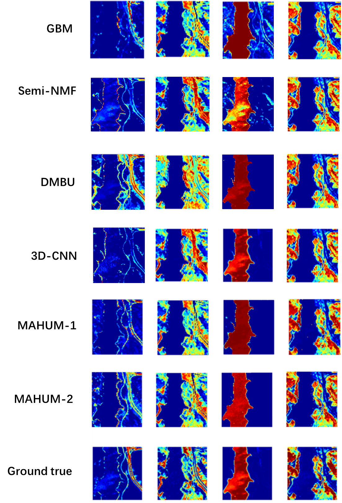
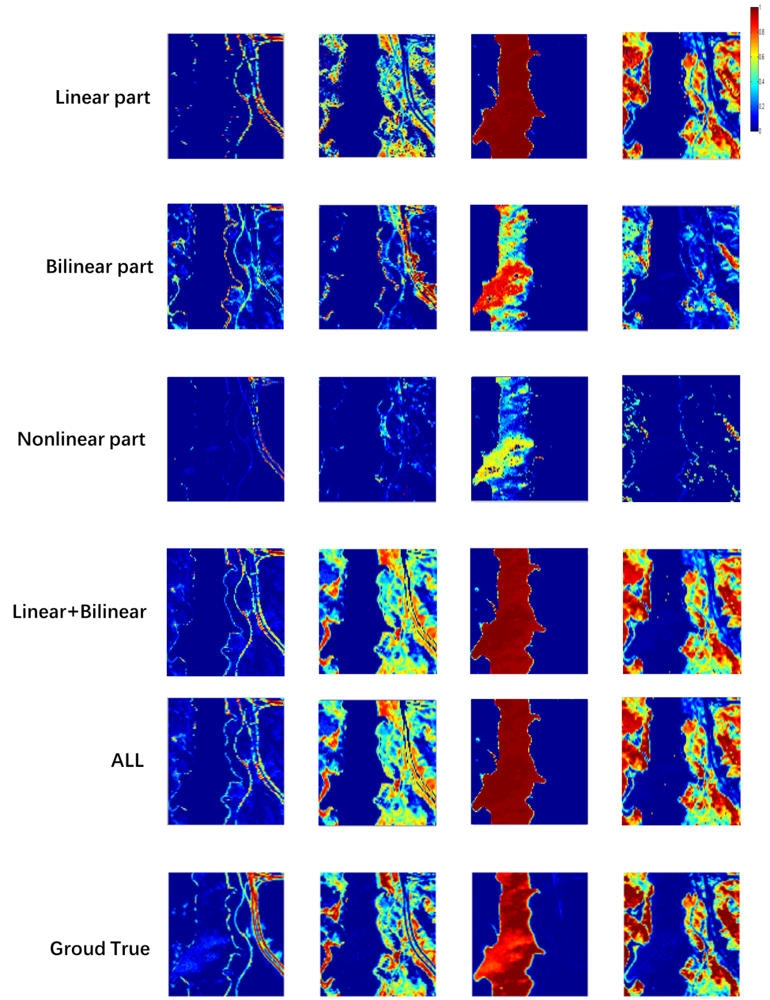

# multi-channel autoencoder hyperspectral unmixing model(MAHUM)
#
If you find this code useful in your research, please consider citing our work:

```
@ARTICLE{MAHUM,
  author={Chen, Jia and Gamba, Paolo and Li, Jun},
  journal={IEEE Transactions on Geoscience and Remote Sensing}, 
  title={MAHUM: A Multitasks Autoencoder Hyperspectral Unmixing Model}, 
  year={2023},
  volume={61},
  number={},
  pages={1-16},
  doi={10.1109/TGRS.2023.3304484}}
```
https://ieeexplore.ieee.org/document/10214610

or, If you have any question, please do not hesitate to contact me.

chen_jia@cug.edu.cn

Usage
---------------------
## Preliminary preparation

Torch

Numpy


## Input

image Y


### Some important parameters
m, ：Number of endmembers.

col, band： size of image.

coeff, mu,eps, theta, lambda: some parameters of DMBU.

## Output
endmembers and abundances of three different unmixing methods. (saved as a MAT file)


## Testing
    
After training the MAHUM on the datasets, the extracted abundance and endmember results are saved as a MAT file. You can utilize `./displayresult.m` to evaluate the unmixing performance.


## Dataset
The Jasper Ridge data (512 × 614 pixels) was gathered by AVIRIS over Jasper Ridge in California. The data consist of 224 bands over the wavelength region from 0.38 to 2.5 μm. Considering water vapor and atmospheric effects, bands 1–3, 108–112, 154–166, and 220–224 were removed, leaving a total of 198 spectral bands for our experiments. This work selected a size of 100*100 pixels and retained 198 bands. This data set has four abundances (water, soil, tree, and road).


## Experimental result

### Comparison with other methods.
<p align="center">



### Results of each part.

